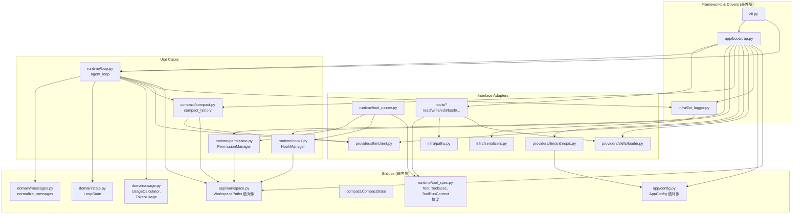

# Mini agent

本项目是一个命令行 agent 助手，通过赋予大模型与现实交互的能力，完成实际任务。

## 项目基础

核心功能是使用 agent_loop，通过反复询问 LLM、执行 tool，达到目的。
需要接受用户输入，调取 API 接口，根据响应调用工具或结束任务。

项目使用 Anthropic SDK，需要了解接口格式。主要就是几个字段，`system` 是系统提示词，主要功能是提醒模型的角色。`messages` 是消息列表，聊天记录。`tools` 是工具集，提供 AI 和现实交互的工具。`stop_sequences` 停止推理，例如，流式输出会持续输出内容，需要停止输出的手段。

优化包括两方面，token 优化，和准确性优化。token 优化是被动的，模型上下文有限，必须考虑到对话持续进行如何处理。准确性优化，就是 Harness 开发的重点。AI 中有很多数据，不同实现之间天差地别。同样的问题，运行多遍，结果都不一致。如何约束 AI 生成的内容，使其效果更好，并具有一致性，就是我所谓的准确性优化。

从流程角度思考优化点。接受输入，如果输入直接超过上下文，那就只能截断了，这和 agent 无关，是产品的优化。拿到用户输入问题，我们就需要拼接接口参数了。`system` 是常驻提示词，这部分只能写非常重要的东西。描述应该越简单越好，越简单用的 token 越少。skill 使用，也会加在 system 中，skill 的动态加载就是为了减少 token 的使用。接着是 messages，messages 中不仅有对话内容，还涉及 tool 调用结果。tool 结果长度不定，在模型读取结果后，结果用处就不大了。就和 Plan 一样，模型只需知道那一步是完成的，并以此推理任务后续如何进行。所以，我们可以把已经完成的 tool 结果替换成占位符。调用接口后，需要调用 tool，或者停止对话。如果继续调用 tool，需要将结果写入 messages，重新请求。每次请求，需要考虑是否超过上下文窗口。

流程如下

```bash
    用户输入（循环等待输入）
        ｜
        v
    接受输入，开启对话
        ｜
        v
    循环请求接口      ->      请求处理优化
                                ｜
                                v
                    Check skill 加载，加载进 system
                                ｜
        ^                       v
        |           消息压缩，陈旧 tool_result 替换
                                ｜
                                v
                检查是否超过上下文窗口，快超过调用 llm 压缩
                                ｜
                                v
        <-       调用接口，根据返回值，调用 tool
```

整体架构参考 clean architecture，外层依赖内层，不能反转。最内层 Entities，对应 Domain，内部业务实体封装，包括 Use Case 也可以封装在里面。

Interface Adapters 包括 infra、provider、tools，通过 runtime 作为 controller，实现交互控制



主体有两个循环，一个是循环接受用户输入，获取任务，另一个是 agent_loop，也就是循环调用 llm，解决问题。入口为 cli.py，入口只负责和用户交互，包括获取用户输入，反馈任务执行结果，拿到输入后把问题委托给 agent_loop 处理。

## Development

- Install dependencies: `poetry install`
- Run locally: `./scripts/run_local.sh`
- Run tests: `poetry run pytest`
