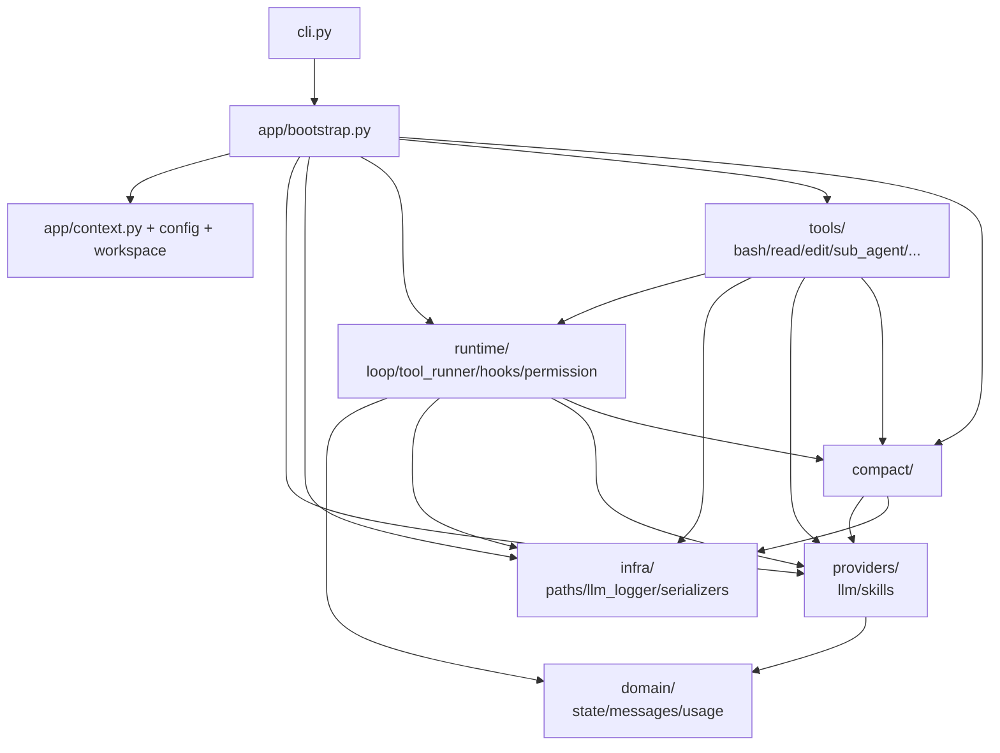

# 项目分层架构说明

本文档描述 `mini-claude-code` 重构后的目录结构、各层职责，以及背后的设计取舍。
所有术语沿用业界通行说法，便于检索与对照（依赖注入、组合根、协议、整洁架构等）。

## 1. 设计目标

项目从早期的「按粗粒度功能分组」演进到「按职责分层」，主要解决三个问题：

1. **消除模块加载时的副作用**：原来 `config.py` 在 import 时就 `load_dotenv`、
   `state.WorkspaceState` 在类属性默认值里调用 `Config.from_env()`、
   `core.agent` 顶层创建 `LLMCallLogger()` 单例。所有这些副作用都使得
   单元测试与多次实例化变得困难。
2. **消除反向依赖与循环依赖**：原来 `core.permission` 反向依赖 `state`，
   `tools.sub_agent` 与 `compact.compact` 都靠延迟 import（lazy import）
   才能避开循环。
3. **统一依赖管理**：`Config`、`workspace`、`logger`、`permission`、`hooks`
   原本分散在多个模块各自实例化。重构后**只有一个组合根（Composition Root）**
   `app/bootstrap.py::build_app_context()` 负责所有依赖的构造。

整体思路参考 **整洁架构（Clean Architecture）/ 洋葱架构（Onion Architecture）**：
内层（业务对象）不依赖外层（运行期、装配层），外层通过**依赖注入
（Dependency Injection）**把内层服务传给运行期组件。

## 2. 分层结构总览

| 层 | 职责 | 是否允许有副作用 | 可被谁依赖 |
| --- | --- | --- | --- |
| `domain/` | 纯业务对象与规则 | 否 | 任何层 |
| `infra/` | 基础设施（路径校验、日志写入、序列化） | 否（IO 只在调用时发生） | 任何层 |
| `providers/` | 外部服务适配（LLM 客户端、Skill 加载器） | 否（同上） | runtime / tools / app |
| `compact/` | 上下文压缩策略 | 否 | runtime / tools / app |
| `runtime/` | Agent 运行时（循环、工具调度、钩子、权限） | 否 | tools / app / cli |
| `tools/` | 具体工具实现 | 否 | app / cli |
| `app/` | 装配层（组合根） | **是**（仅此一处） | cli |
| `cli.py` | 命令行交互入口 | 仅终端 IO | 不被任何模块依赖 |

**根本约束**：依赖箭头**只能从外向内**（从更靠近副作用的层指向更纯净的层）。
内层 `domain` / `infra` / `providers` **不能** import 外层 `runtime` / `tools` / `app` / `cli`。

## 3. 依赖关系示意



## 4. 各层详解

### 4.1 `domain/` — 业务模型层

存放与外部 IO 无关的业务对象与规则：

- `state.py`：`LoopState`、`generate_session_id` —— Agent 循环的状态机字段。
- `messages.py`：`normalize_messages` —— 把内部消息列表整理成 Anthropic API 协议要求的格式。
- `usage.py`：`TokenUsage`（TypedDict）、`UsageCalculator` —— token 用量统计。

**禁止**：import `runtime` / `tools` / `app` / `cli` / `providers` / `infra`。

### 4.2 `infra/` — 基础设施层

不带业务语义、可在任何项目中复用的技术组件：

- `paths.py`：`safe_path(path, workspace)` —— 路径安全校验。
- `llm_logger.py`：`LLMCallLogger` —— JSONL 格式记录每次 LLM 调用。
- `serializers.py`：`to_jsonable` —— 把 SDK 对象转成 JSON 可写入结构。

**禁止**：import 上层；自身**不持有**全局单例，所有实例由组合根创建。

### 4.3 `providers/` — 外部服务适配层

封装第三方 SDK 与外部资源，向上层暴露稳定接口：

- `providers/llm/spec.py`：`LLMCaller` 协议（Protocol）—— 定义"调一次 LLM"的统一签名。
- `providers/llm/client.py`：`call_llm` —— 通用调用入口（不绑定供应商）。
- `providers/llm/anthropic.py`：`create_anthropic_client` —— Anthropic 客户端工厂。
- `providers/skills/loader.py`：`SkillLoader` —— 加载 `SKILL.md` frontmatter。

通过 `LLMCaller` 协议，`compact/` 与 `runtime/loop.py` 不需要知道当前使用哪家 LLM；
未来要接入 OpenAI 只需新增 `providers/llm/openai.py`，**其它代码不动**。

### 4.4 `compact/` — 上下文压缩

负责对话历史的体积控制：

- `CompactState` —— 压缩相关的会话级状态（`recent_files` 等）。
- `micro_compact` —— 把陈旧 `tool_result` 替换为占位符（不调用 LLM）。
- `compact_history` —— 调用 LLM 总结历史，写入 transcript。
- `persist_large_output` —— 大型工具输出落盘并生成预览引用。

所有函数都通过参数显式接收 `workspace: WorkspacePaths` 与 `llm_call: LLMCaller`，
**没有任何模块级路径常量或单例**。

### 4.5 `runtime/` — Agent 运行时层

Agent 主循环与工具执行调度：

- `tool_spec.py`：`ToolSpec`、`Tool` 协议、`ToolRunContext` 协议 —— 工具的形状定义。
- `tool_registry.py`：`ToolRegistry` —— 工具注册表。
- `tool_runner.py`：`ToolRunner` —— 单轮工具执行调度器，
  实现 **PreToolUse → 权限校验 → 工具执行 → PostToolUse** 流水线。
- `permission.py`：`PermissionManager` + `BashSecurityValidator` —— 权限决策。
- `hooks.py`：`HookManager` —— 加载并执行 `.hooks.json` 配置的钩子命令。
- `loop.py`：`AgentLoopConfig`、`AgentLoopContext`、`agent_loop`、`run_one_turn` —— 主循环。

`AgentLoopContext` 是**上下文对象（Context Object）模式**的应用：
把运行期所有依赖（client、workspace、compact_state、llm_logger、usage、hooks 等）
聚到一个对象上，工具与钩子通过它读取状态、注册回调，避免再依赖全局变量。

### 4.6 `tools/` — 工具实现

每个工具是一个 dataclass，对外暴露 `spec` 属性与 `run(tool_input, context)` 方法。
不再持有自己的全局状态；需要的依赖（client、workspace、llm_logger 等）通过构造函数注入。

- 内置工具：`bash`、`read_file`、`write_file`、`edit_file`、`load_skill`、`task`。
- 高阶工具：`sub_agent`（启动子 agent）、`compact_tool`（手动触发压缩）。

危险命令的拦截统一交给 `runtime.permission.BashSecurityValidator`，
工具自身**不再带黑名单**。

### 4.7 `app/` — 装配层（组合根）

唯一允许触发副作用的层：

- `config.py`：`AppConfig` —— 从环境变量读出来的配置数据类（无 `load_dotenv`）。
- `workspace.py`：`WorkspacePaths` —— 工作区根目录及其下所有约定路径的集中描述。
- `context.py`：`AppContext` —— 聚合所有会话级依赖的容器。
- `bootstrap.py`：`build_app_context()` / `build_main_registry()` /
  `build_subagent_registry()` / `build_tool_runner()` —— 唯一组合根。

`build_app_context` 负责：
1. 调用 `load_dotenv`；
2. 实例化 `AppConfig`、`WorkspacePaths`、`Anthropic` client；
3. 实例化 `LLMCallLogger`、`SkillLoader`、`PermissionManager`、`HookManager`、
   `UsageCalculator`、`CompactState`；
4. 把以上对象塞进 `AppContext` 返回。

### 4.8 `cli.py` — 命令行入口

只做三件事：
1. 打印 banner、读取权限模式；
2. 调 `build_app_context(mode)` 拿到一个完整的 `AppContext`；
3. 在 REPL 循环里反复调 `agent_loop`，退出时调 `ctx.usage.flush()`。

不再持有任何模块级常量或全局对象。

## 5. 关键设计决策

### 5.1 单一组合根（Composition Root）

所有依赖只在 `app/bootstrap.py` 中构造一次。这是依赖注入领域的标准做法：
**应用程序应有且只有一个地方负责把对象图组装起来**，其它地方只消费已经组装好的对象。
好处：
- 单元测试时可以用替身（fake / stub）替换 `bootstrap` 产物，不需要 monkey-patch 模块全局。
- 避免"a 处用 cwd，b 处用注入 workspace"这种行为不一致。
- 任何环境差异（生产 / 测试 / SDK 嵌入）只改一处。

### 5.2 依赖注入而非全局单例

重构前存在的模块级单例：

| 旧位置 | 旧形式 | 新位置 |
| --- | --- | --- |
| `core.agent` | `llm_call_logger = LLMCallLogger()` | `AppContext.llm_logger` |
| `core.permission` | `permission_manager = PermissionManager()` | `AppContext.permission` |
| `compact.compact` | `compact_state = CompactState()` | `AppContext.compact_state` |
| `utils.usage_calc` | `usage_calculator = UsageCalculator()` | `AppContext.usage` |

全局单例的最大问题是「隐式依赖」：调用方看不到它依赖了什么。
依赖注入把依赖列在构造函数 / 函数参数上，调用关系一目了然。

### 5.3 用协议（Protocol）声明能力

Python 的 `typing.Protocol` 提供**结构化子类型（Structural Subtyping）**：
任何对象只要"长得对"就符合协议，无需显式继承。本项目使用了两个关键协议：

- `Tool` Protocol（`runtime/tool_spec.py`）：拥有 `spec` 属性与 `run(tool_input, context)` 方法即可注册为工具。
- `LLMCaller` Protocol（`providers/llm/spec.py`）：把"调用一次 LLM"的签名抽象出来，让 `compact/` 不直接依赖 Anthropic SDK。

这使得**新增工具或切换 LLM 供应商时不需要改变上层接口**。

### 5.4 钩子流水线

`runtime/tool_runner.py` 实现了完整的钩子流水线：

```
LLM 输出 tool_use 块
        |
        v
  PreToolUse hook   ← 可改写 tool_input、注入 additionalContext、blocked、permissionDecision
        |
        v
  PermissionManager ← 若 hook 没给出 permissionDecision，按规则 / 模式 / 询问决策
        |
        v
  Tool.run          ← 实际执行工具
        |
        v
  PostToolUse hook  ← 可在执行后再次注入 additionalContext
        |
        v
  生成 tool_result 写回对话
```

钩子通过外部脚本与 stdout JSON 通信，遵循 Claude Code 既定约定。

### 5.5 上下文对象模式

`AgentLoopContext` 把运行期需要的状态与依赖聚到一个对象上：
工具拿到它后能 `add_after_round_once(cb)` 注册一次性回调（例如 `compact_tool` 让自己的执行落在本轮 LLM 应答完成之后），也能直接访问 `state` / `compact_state` / `workspace`。
这避免了运行时通过全局变量传递状态。

### 5.6 显式状态字段

`LoopState` 与 `CompactState` 都用 `@dataclass` 把每个状态字段显式列出来。
这比用 `dict` / `setattr` 隐式累加字段更易读、更易做静态检查、更易序列化。

## 6. 后续扩展指引

### 6.1 新增一个工具

1. 在 `tools/` 下新建文件，定义一个 dataclass 实现：
   ```python
   @property
   def spec(self) -> ToolSpec: ...
   def run(self, tool_input: JsonObject, context) -> str: ...
   ```
2. 在 `app/bootstrap.py::build_main_registry()`（或 `build_subagent_registry`）中追加。
3. 不需要改其它任何文件。

### 6.2 接入一个钩子脚本

1. 在工作区根目录创建 `.hooks.json`，按 `PreToolUse / PostToolUse / SessionStart` 配置命令。
2. 创建 `.claude/.claude_trusted` 标记文件（信任工作区，否则钩子不会执行）。
3. 启动后 `runtime` 自动加载并触发，无需改代码。

### 6.3 新增一个 LLM 供应商

1. 在 `providers/llm/` 下新建模块，实现 `LLMCaller` 协议。
2. 在 `app/bootstrap.py::build_app_context` 中切换工厂方法。
3. `runtime/` 与 `compact/` 不需要任何改动。

### 6.4 新增权限规则或模式

1. 在 `runtime/permission.py::DEFAULT_RULES` 追加规则；或在 `bootstrap` 构造 `PermissionManager` 时通过 `rules=` 参数注入。
2. 模式新增需要同步更新 `MODES` 常量与 `cli._ask_mode` 输入校验。

## 7. 命名约定

- 模块名小写、用下划线分隔（`tool_runner.py`，不是 `toolRunner.py`）。
- 类名使用 PascalCase（`AgentLoopConfig`、`WorkspacePaths`）。
- 协议（Protocol）类名以场景而非 `IXxx` / `XxxProtocol` 命名，例如 `LLMCaller`、`Tool`。
- 包名（目录）使用领域名词单数（`runtime`、`infra`），不使用动词或缩写。

## 8. 不要做的事

- 不要在模块顶层调用 `Path.cwd()` / `os.getenv()` / `load_dotenv()`。
- 不要再创建 `xxx_manager = XxxManager()` 这类模块级单例；如果一个对象需要全局可见，把它放进 `AppContext`。
- 不要在 `domain/` / `infra/` / `providers/` 中 import 上层模块；如果发现需要，先思考是不是依赖方向错了。
- 不要在 `tools/` 中直接 import `app/`；工具需要的资源应通过构造函数注入。
